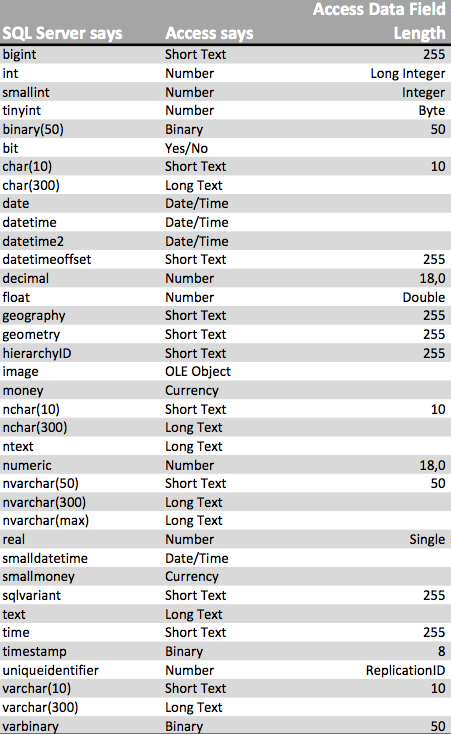
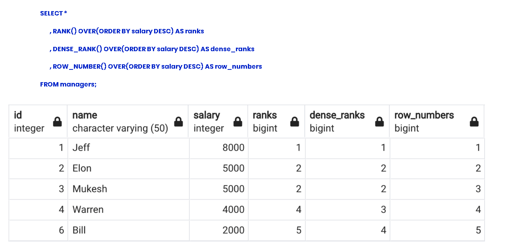

# Sql

## MSSQL to Access Type Mapping

## What is the difference between RANK, DENSE_RANK and ROW_NUMBER window function?

## Memory Optimized Tables are fast
[Full example of performance comparizon using memory optimized tables](https://www.sqlshack.com/using-memory-optimized-tables-to-replace-sql-server-temp-tables-and-table-variables/)
